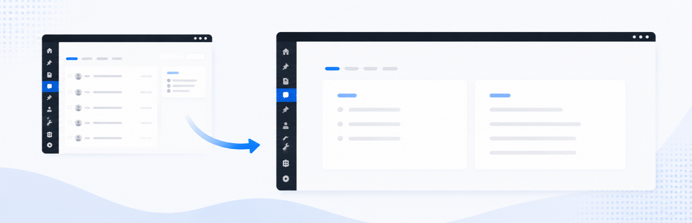

# WPPack Disable Comments

WordPress のコメント機能を完全に無効化するプラグイン。有効化すればコメント
システム全体が消え、無効化すればすべて元通り。設定画面はなく、データベースに
オプションも作りません。

## 何をするか

**ディスカッション**

- 全投稿タイプでコメントとピンバックをクローズ(テーマやプラグインが
  上書きできない優先度で)。
- 既存コメントは一切表示されない: テンプレートには空のスレッドと 0 件の
  カウントが渡るため、コメント一覧も「コメント N 件」リンクも出ません。
- ディスカッション系のコメントクエリはデータベースに到達する前に
  ショートサーキット — 最新コメントブロック、クラシックの最近のコメント
  ウィジェット、直接の `WP_Comment_Query` もすべて空になります。

**ブロックエディタ**

- コメント関係のブロック — コメント(とその内部ブロック)、コメントフォーム、
  最新コメント、コメント数/リンク — をインサーターから隠し、フロントでは
  何も出力しません。コンテンツやテンプレートに挿入済みのブロックはそのまま
  残り(「利用できないブロック」警告は出ません)、無効化すれば元通りです。
- サイトエディターの「ホーム」「インデックス」テンプレートに出る
  「ディスカッション」行(サイト全体のコメント初期設定を変更する UI)を
  非表示にします。

**wp-admin**

- コメントメニュー、設定 › ディスカッション、ツールバーのコメントバブル、
  クラシックの最近のコメントウィジェットを除去。ダッシュボードの「概要」
  「アクティビティ」にもコメントは表示されません。全投稿タイプから
  comments / trackbacks サポートを外すため、ディスカッションメタボックス、
  ブロックエディタのディスカッションパネル、一覧テーブルのコメント列も
  消えます。
- `edit-comments.php`・`comment.php`・`options-discussion.php` への直接
  アクセスはダッシュボードへリダイレクト。

**フィードと機械向けサーフェス**

- コメントフィード URL は 404 になり、`<link>` タグも head から消えます。
- `X-Pingback` ヘッダー、RSD リンク、pingback URL を除去。REST の
  `/wp/v2/comments` ルートと、コメント/ピンバック関連の XML-RPC メソッドを
  すべて登録解除し、投稿/固定ページの REST レスポンスから `replies` リンク
  も外します。

## あえてしないこと

- **既存コメントはデータベースに残ります。** 削除も書き換えもしないため、
  プラグインを無効化すれば元の状態にそのまま戻ります。
- **ディスカッション以外のコメントタイプは動き続けます。** コメントとして
  独自レコードを保存するプラグイン(WooCommerce の注文メモなど)は自分の
  タイプを指定してクエリするため、影響を受けません。

## 動作要件

PHP 8.2 以上、WordPress 6.7 以上。

## ライセンス

MIT
